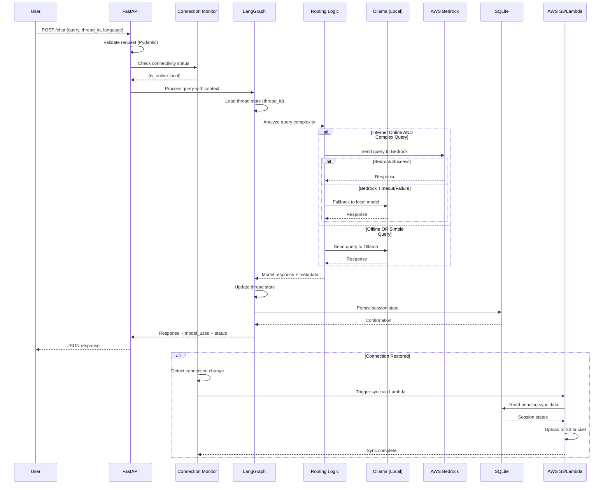

# Design: Vidya-Local

## Overview
Vidya-Local is an offline-first AI educational tutor built with FastAPI, LangGraph, and Ollama. This design document outlines the system architecture, component interactions, data flows, API specifications, and correctness properties that ensure the system meets all requirements.

## System Architecture

### High-Level Architecture

```
┌─────────────────────────────────────────────────────────────┐
│                         Client Layer                         │
│                    (Web/Mobile Interface)                    │
└──────────────────────────┬──────────────────────────────────┘
                           │ HTTP/REST
┌──────────────────────────▼──────────────────────────────────┐
│                     FastAPI Backend                          │
│  ┌────────────────────────────────────────────────────────┐ │
│  │  API Routes (/chat, /sync, /session, /language)       │ │
│  └────────────────┬───────────────────────────────────────┘ │
│                   │                                          │
│  ┌────────────────▼───────────────────────────────────────┐ │
│  │         Connection Monitor Service                     │ │
│  └────────────────┬───────────────────────────────────────┘ │
└───────────────────┼──────────────────────────────────────────┘
                    │
┌───────────────────▼──────────────────────────────────────────┐
│                  LangGraph Orchestrator                       │
│  ┌──────────────────────────────────────────────────────┐   │
│  │  State Management (thread_id, history, context)      │   │
│  └──────────────────────────────────────────────────────┘   │
│  ┌──────────────────────────────────────────────────────┐   │
│  │  Routing Logic Node (complexity + connectivity)      │   │
│  └──────────────────────────────────────────────────────┘   │
└───────────┬─────────────────────────────────┬────────────────┘
            │                                 │
            │ Local                           │ Cloud (when online)
┌───────────▼──────────────┐    ┌──────────▼─────────────────────┐
│    Ollama Local LLM      │    │    Amazon Bedrock (Boto3)      │
│  (llama2, mistral, etc)  │    │  (Claude, Titan, etc)          │
└──────────────────────────┘    └────────────────────────────────┘

┌─────────────────────────────────────────────────────────────┐
│                    Storage Layer                             │
│  ┌──────────────────┐  ┌──────────────────┐                 │
│  │  Local SQLite    │  │   AWS S3         │                 │
│  │  (Session State) │  │  (Sync Storage)  │                 │
│  └──────────────────┘  └──────────────────┘                 │
│                         (via AWS Lambda)                     │
└─────────────────────────────────────────────────────────────┘
```

### Component Responsibilities

**FastAPI Backend**:
- Exposes REST API endpoints for client interactions
- Manages HTTP request/response lifecycle
- Validates input using Pydantic models
- Coordinates with LangGraph orchestrator
- Monitors internet connectivity status

**LangGraph Orchestrator**:
- Maintains stateful conversation threads
- Implements routing logic for model selection
- Manages conversation history and context
- Coordinates between local and cloud LLMs
- Handles language preference persistence

**Ollama Local LLM**:
- Provides offline inference capabilities
- Processes queries when internet is unavailable
- Serves as fallback for cloud failures

**Amazon Bedrock**:
- Handles complex queries requiring advanced reasoning
- Provides enhanced model capabilities when online
- Accessed via Boto3 SDK

**Storage Layer**:
- Local SQLite: Immediate persistence of session state
- AWS S3: Cloud backup and sync via Lambda functions


## Data Flow

### Request Flow Sequence Diagram




## Component Design

### LangGraph State Schema

```python
from typing import TypedDict, List, Literal, Optional
from datetime import datetime

class Message(TypedDict):
    """Individual message in conversation"""
    role: Literal["user", "assistant", "system"]
    content: str
    timestamp: datetime
    language: str
    model_used: Optional[str]  # "ollama", "bedrock", or None

class LearningMilestone(TypedDict):
    """Track learning progress"""
    topic: str
    timestamp: datetime
    comprehension_score: Optional[float]  # 0.0 to 1.0
    
class GraphState(TypedDict):
    """Complete LangGraph state schema"""
    # Session identification
    thread_id: str
    user_id: str
    
    # Conversation state
    messages: List[Message]
    current_query: str
    current_language: str
    
    # Routing metadata
    is_online: bool
    query_complexity: Literal["simple", "moderate", "complex"]
    selected_model: Literal["ollama", "bedrock"]
    
    # Learning tracking
    session_start: datetime
    last_interaction: datetime
    milestones: List[LearningMilestone]
    topics_covered: List[str]
    
    # Response metadata
    response: Optional[str]
    model_used: Optional[str]
    response_time_ms: Optional[int]
    error: Optional[str]
```


### Routing Logic Node

The routing logic node is a critical component that determines which LLM to use based on connectivity and query complexity.

```python
def routing_logic_node(state: GraphState) -> GraphState:
    """
    Determines which model to use based on:
    1. Internet connectivity status
    2. Query complexity analysis
    3. Fallback requirements
    """
    
    # Step 1: Analyze query complexity
    complexity = analyze_query_complexity(state["current_query"])
    state["query_complexity"] = complexity
    
    # Step 2: Check connectivity
    is_online = state["is_online"]
    
    # Step 3: Apply routing logic
    if is_online and complexity == "complex":
        state["selected_model"] = "bedrock"
    else:
        state["selected_model"] = "ollama"
    
    return state

def analyze_query_complexity(query: str) -> Literal["simple", "moderate", "complex"]:
    """
    Analyzes query complexity based on:
    - Token count (length)
    - Presence of multi-step reasoning keywords
    - Question depth indicators
    """
    token_count = len(query.split())
    
    # Complex indicators
    complex_keywords = [
        "explain why", "compare", "analyze", "evaluate",
        "step by step", "multiple", "relationship between"
    ]
    
    has_complex_keywords = any(kw in query.lower() for kw in complex_keywords)
    
    if token_count > 100 or has_complex_keywords:
        return "complex"
    elif token_count > 30:
        return "moderate"
    else:
        return "simple"
```


### LangGraph Workflow Definition

```python
from langgraph.graph import StateGraph, END

def create_vidya_graph() -> StateGraph:
    """Creates the LangGraph workflow"""
    
    workflow = StateGraph(GraphState)
    
    # Define nodes
    workflow.add_node("load_session", load_session_node)
    workflow.add_node("routing_logic", routing_logic_node)
    workflow.add_node("ollama_inference", ollama_inference_node)
    workflow.add_node("bedrock_inference", bedrock_inference_node)
    workflow.add_node("update_state", update_state_node)
    workflow.add_node("persist_state", persist_state_node)
    
    # Define edges
    workflow.set_entry_point("load_session")
    workflow.add_edge("load_session", "routing_logic")
    
    # Conditional routing based on model selection
    workflow.add_conditional_edges(
        "routing_logic",
        lambda state: state["selected_model"],
        {
            "ollama": "ollama_inference",
            "bedrock": "bedrock_inference"
        }
    )
    
    # Both inference paths lead to state update
    workflow.add_edge("ollama_inference", "update_state")
    workflow.add_edge("bedrock_inference", "update_state")
    workflow.add_edge("update_state", "persist_state")
    workflow.add_edge("persist_state", END)
    
    return workflow.compile()
```


## API Specification

### Pydantic Models

```python
from pydantic import BaseModel, Field, validator
from typing import Optional, List, Literal
from datetime import datetime

class ChatRequest(BaseModel):
    """Request model for /chat endpoint"""
    query: str = Field(..., min_length=1, max_length=5000, description="User's question")
    thread_id: Optional[str] = Field(None, description="Session thread ID for continuity")
    language: Literal["en", "hi", "ta", "te", "bn", "mr"] = Field("en", description="Response language")
    user_id: str = Field(..., description="Unique user identifier")
    
    @validator("query")
    def query_not_empty(cls, v):
        if not v.strip():
            raise ValueError("Query cannot be empty")
        return v.strip()

class ChatResponse(BaseModel):
    """Response model for /chat endpoint"""
    response: str = Field(..., description="AI-generated response")
    thread_id: str = Field(..., description="Session thread ID")
    model_used: Literal["ollama", "bedrock"] = Field(..., description="Model that generated response")
    is_online: bool = Field(..., description="Connection status during request")
    language: str = Field(..., description="Language of response")
    response_time_ms: int = Field(..., description="Response generation time")
    timestamp: datetime = Field(default_factory=datetime.utcnow)
    
class SyncRequest(BaseModel):
    """Request model for /sync endpoint"""
    user_id: str = Field(..., description="User identifier")
    force_sync: bool = Field(False, description="Force sync even if recently synced")

class SyncResponse(BaseModel):
    """Response model for /sync endpoint"""
    success: bool = Field(..., description="Sync operation success status")
    synced_sessions: int = Field(..., description="Number of sessions synced")
    s3_location: Optional[str] = Field(None, description="S3 bucket location")
    timestamp: datetime = Field(default_factory=datetime.utcnow)
    error: Optional[str] = Field(None, description="Error message if sync failed")

class SessionHistoryResponse(BaseModel):
    """Response model for /session/history endpoint"""
    thread_id: str
    session_start: datetime
    last_interaction: datetime
    message_count: int
    topics_covered: List[str]
    milestones: List[dict]

class LanguageUpdateRequest(BaseModel):
    """Request model for /language endpoint"""
    user_id: str = Field(..., description="User identifier")
    language: Literal["en", "hi", "ta", "te", "bn", "mr"] = Field(..., description="New language preference")
    thread_id: Optional[str] = Field(None, description="Apply to specific thread or globally")
```


### API Endpoints

#### POST /chat
Primary endpoint for user queries.

**Request**:
```json
{
  "query": "Explain photosynthesis in simple terms",
  "thread_id": "thread_abc123",
  "language": "en",
  "user_id": "user_xyz789"
}
```

**Response**:
```json
{
  "response": "Photosynthesis is the process by which plants...",
  "thread_id": "thread_abc123",
  "model_used": "ollama",
  "is_online": false,
  "language": "en",
  "response_time_ms": 3421,
  "timestamp": "2026-02-06T10:30:00Z"
}
```

**Status Codes**:
- 200: Success
- 400: Invalid request (validation error)
- 500: Server error (model failure)
- 503: Service unavailable (no models available)

#### POST /sync
Manually trigger sync to AWS S3.

**Request**:
```json
{
  "user_id": "user_xyz789",
  "force_sync": false
}
```

**Response**:
```json
{
  "success": true,
  "synced_sessions": 5,
  "s3_location": "s3://vidya-local-data/user_xyz789/",
  "timestamp": "2026-02-06T10:35:00Z",
  "error": null
}
```

**Status Codes**:
- 200: Sync successful
- 202: Sync queued (will retry)
- 400: Invalid request
- 503: Service unavailable (no internet)


#### GET /session/history/{user_id}
Retrieve user's learning session history.

**Response**:
```json
{
  "sessions": [
    {
      "thread_id": "thread_abc123",
      "session_start": "2026-02-06T09:00:00Z",
      "last_interaction": "2026-02-06T10:30:00Z",
      "message_count": 12,
      "topics_covered": ["photosynthesis", "cellular respiration"],
      "milestones": [
        {
          "topic": "photosynthesis",
          "timestamp": "2026-02-06T09:15:00Z",
          "comprehension_score": 0.85
        }
      ]
    }
  ]
}
```

#### PUT /language
Update user's language preference.

**Request**:
```json
{
  "user_id": "user_xyz789",
  "language": "hi",
  "thread_id": "thread_abc123"
}
```

**Response**:
```json
{
  "success": true,
  "language": "hi",
  "applied_to": "thread_abc123"
}
```

#### GET /health
Health check endpoint.

**Response**:
```json
{
  "status": "healthy",
  "ollama_available": true,
  "bedrock_available": true,
  "is_online": true,
  "local_db_status": "connected"
}
```


## AWS Integration

### Boto3 Client Configuration

```python
import boto3
from botocore.config import Config

class AWSClientManager:
    """Manages AWS service clients with proper configuration"""
    
    def __init__(self):
        self.config = Config(
            region_name='us-east-1',
            retries={'max_attempts': 3, 'mode': 'adaptive'},
            connect_timeout=5,
            read_timeout=10
        )
        
    def get_bedrock_client(self):
        """Initialize Bedrock runtime client"""
        return boto3.client(
            'bedrock-runtime',
            config=self.config,
            aws_access_key_id=os.getenv('AWS_ACCESS_KEY_ID'),
            aws_secret_access_key=os.getenv('AWS_SECRET_ACCESS_KEY')
        )
    
    def get_s3_client(self):
        """Initialize S3 client"""
        return boto3.client(
            's3',
            config=self.config,
            aws_access_key_id=os.getenv('AWS_ACCESS_KEY_ID'),
            aws_secret_access_key=os.getenv('AWS_SECRET_ACCESS_KEY')
        )
    
    def get_lambda_client(self):
        """Initialize Lambda client for triggering sync"""
        return boto3.client(
            'lambda',
            config=self.config,
            aws_access_key_id=os.getenv('AWS_ACCESS_KEY_ID'),
            aws_secret_access_key=os.getenv('AWS_SECRET_ACCESS_KEY')
        )
```

### Amazon Bedrock Integration

```python
import json
from typing import Dict, Any

class BedrockService:
    """Service for interacting with Amazon Bedrock"""
    
    def __init__(self, client_manager: AWSClientManager):
        self.client = client_manager.get_bedrock_client()
        self.model_id = "anthropic.claude-3-sonnet-20240229-v1:0"
    
    async def invoke_model(self, prompt: str, language: str) -> Dict[str, Any]:
        """
        Invoke Bedrock model with timeout and error handling
        """
        try:
            # Prepare request body
            body = json.dumps({
                "anthropic_version": "bedrock-2023-05-31",
                "max_tokens": 2048,
                "messages": [
                    {
                        "role": "user",
                        "content": f"Respond in {language} language: {prompt}"
                    }
                ],
                "temperature": 0.7
            })
            
            # Invoke model with 10-second timeout
            response = self.client.invoke_model(
                modelId=self.model_id,
                body=body,
                contentType='application/json',
                accept='application/json'
            )
            
            # Parse response
            response_body = json.loads(response['body'].read())
            return {
                "success": True,
                "response": response_body['content'][0]['text'],
                "model": "bedrock"
            }
            
        except Exception as e:
            return {
                "success": False,
                "error": str(e),
                "model": "bedrock"
            }
```


### AWS S3 Storage Strategy

**Bucket Structure**:
```
s3://vidya-local-data/
├── users/
│   ├── {user_id}/
│   │   ├── sessions/
│   │   │   ├── {thread_id}_metadata.json
│   │   │   └── {thread_id}_messages.json
│   │   ├── preferences.json
│   │   └── sync_manifest.json
```

**S3 Service Implementation**:
```python
import json
from datetime import datetime
from typing import List, Dict

class S3StorageService:
    """Manages S3 storage operations"""
    
    def __init__(self, client_manager: AWSClientManager):
        self.client = client_manager.get_s3_client()
        self.bucket_name = os.getenv('S3_BUCKET_NAME', 'vidya-local-data')
    
    async def sync_session_data(self, user_id: str, sessions: List[Dict]) -> Dict:
        """
        Sync local session data to S3
        """
        try:
            synced_count = 0
            
            for session in sessions:
                thread_id = session['thread_id']
                
                # Upload session metadata
                metadata_key = f"users/{user_id}/sessions/{thread_id}_metadata.json"
                self.client.put_object(
                    Bucket=self.bucket_name,
                    Key=metadata_key,
                    Body=json.dumps({
                        'thread_id': thread_id,
                        'session_start': session['session_start'].isoformat(),
                        'last_interaction': session['last_interaction'].isoformat(),
                        'topics_covered': session['topics_covered'],
                        'milestones': session['milestones']
                    }),
                    ContentType='application/json',
                    ServerSideEncryption='AES256'
                )
                
                # Upload messages
                messages_key = f"users/{user_id}/sessions/{thread_id}_messages.json"
                self.client.put_object(
                    Bucket=self.bucket_name,
                    Key=messages_key,
                    Body=json.dumps(session['messages']),
                    ContentType='application/json',
                    ServerSideEncryption='AES256'
                )
                
                synced_count += 1
            
            # Update sync manifest
            manifest_key = f"users/{user_id}/sync_manifest.json"
            self.client.put_object(
                Bucket=self.bucket_name,
                Key=manifest_key,
                Body=json.dumps({
                    'last_sync': datetime.utcnow().isoformat(),
                    'synced_sessions': synced_count
                }),
                ContentType='application/json',
                ServerSideEncryption='AES256'
            )
            
            return {
                'success': True,
                'synced_sessions': synced_count,
                's3_location': f"s3://{self.bucket_name}/users/{user_id}/"
            }
            
        except Exception as e:
            return {
                'success': False,
                'error': str(e)
            }
```


### AWS Lambda Sync Function

**Lambda Function Purpose**: Triggered automatically when connection is restored to sync local data to S3.

**Lambda Handler**:
```python
import json
import boto3
from datetime import datetime

def lambda_handler(event, context):
    """
    Lambda function to sync session data from local to S3
    Triggered by API Gateway or EventBridge
    """
    
    try:
        # Parse event
        body = json.loads(event['body']) if 'body' in event else event
        user_id = body['user_id']
        sessions = body['sessions']
        
        # Initialize S3 client
        s3_client = boto3.client('s3')
        bucket_name = 'vidya-local-data'
        
        synced_count = 0
        
        # Sync each session
        for session in sessions:
            thread_id = session['thread_id']
            
            # Store session data
            metadata_key = f"users/{user_id}/sessions/{thread_id}_metadata.json"
            s3_client.put_object(
                Bucket=bucket_name,
                Key=metadata_key,
                Body=json.dumps(session),
                ServerSideEncryption='AES256'
            )
            
            synced_count += 1
        
        return {
            'statusCode': 200,
            'body': json.dumps({
                'success': True,
                'synced_sessions': synced_count,
                'timestamp': datetime.utcnow().isoformat()
            })
        }
        
    except Exception as e:
        return {
            'statusCode': 500,
            'body': json.dumps({
                'success': False,
                'error': str(e)
            })
        }
```

**Lambda IAM Role Requirements**:
```json
{
  "Version": "2012-10-17",
  "Statement": [
    {
      "Effect": "Allow",
      "Action": [
        "s3:PutObject",
        "s3:GetObject",
        "s3:ListBucket"
      ],
      "Resource": [
        "arn:aws:s3:::vidya-local-data/*",
        "arn:aws:s3:::vidya-local-data"
      ]
    },
    {
      "Effect": "Allow",
      "Action": [
        "logs:CreateLogGroup",
        "logs:CreateLogStream",
        "logs:PutLogEvents"
      ],
      "Resource": "arn:aws:logs:*:*:*"
    }
  ]
}
```


## Security Design

### AWS IAM Roles and Policies

**Backend Service Role** (for FastAPI application):
```json
{
  "Version": "2012-10-17",
  "Statement": [
    {
      "Sid": "BedrockInvoke",
      "Effect": "Allow",
      "Action": [
        "bedrock:InvokeModel",
        "bedrock:InvokeModelWithResponseStream"
      ],
      "Resource": [
        "arn:aws:bedrock:*::foundation-model/anthropic.claude-*",
        "arn:aws:bedrock:*::foundation-model/amazon.titan-*"
      ]
    },
    {
      "Sid": "S3Access",
      "Effect": "Allow",
      "Action": [
        "s3:PutObject",
        "s3:GetObject",
        "s3:ListBucket"
      ],
      "Resource": [
        "arn:aws:s3:::vidya-local-data/*",
        "arn:aws:s3:::vidya-local-data"
      ]
    },
    {
      "Sid": "LambdaInvoke",
      "Effect": "Allow",
      "Action": [
        "lambda:InvokeFunction"
      ],
      "Resource": [
        "arn:aws:lambda:*:*:function:vidya-sync-function"
      ]
    }
  ]
}
```

### Environment Variable Management

**Required Environment Variables**:
```bash
# AWS Credentials
AWS_ACCESS_KEY_ID=<access_key>
AWS_SECRET_ACCESS_KEY=<secret_key>
AWS_REGION=us-east-1

# AWS Resources
S3_BUCKET_NAME=vidya-local-data
LAMBDA_SYNC_FUNCTION=vidya-sync-function
BEDROCK_MODEL_ID=anthropic.claude-3-sonnet-20240229-v1:0

# Ollama Configuration
OLLAMA_BASE_URL=http://localhost:11434
OLLAMA_MODEL=llama2

# Database
DATABASE_URL=sqlite:///./vidya_local.db
DATABASE_ENCRYPTION_KEY=<32-byte-key>

# Application
SECRET_KEY=<jwt-secret-key>
ENVIRONMENT=production
LOG_LEVEL=INFO
```

**Environment Variable Loading**:
```python
from pydantic_settings import BaseSettings
from typing import Optional

class Settings(BaseSettings):
    """Application settings with validation"""
    
    # AWS
    aws_access_key_id: str
    aws_secret_access_key: str
    aws_region: str = "us-east-1"
    s3_bucket_name: str = "vidya-local-data"
    lambda_sync_function: str = "vidya-sync-function"
    bedrock_model_id: str = "anthropic.claude-3-sonnet-20240229-v1:0"
    
    # Ollama
    ollama_base_url: str = "http://localhost:11434"
    ollama_model: str = "llama2"
    
    # Database
    database_url: str = "sqlite:///./vidya_local.db"
    database_encryption_key: str
    
    # Application
    secret_key: str
    environment: str = "production"
    log_level: str = "INFO"
    
    class Config:
        env_file = ".env"
        case_sensitive = False

settings = Settings()
```


### Data Encryption

**Local Database Encryption**:
```python
from cryptography.fernet import Fernet
import json

class EncryptionService:
    """Handles AES-256 encryption for local data"""
    
    def __init__(self, encryption_key: str):
        self.cipher = Fernet(encryption_key.encode())
    
    def encrypt_session_data(self, data: dict) -> bytes:
        """Encrypt session data before storing locally"""
        json_data = json.dumps(data)
        return self.cipher.encrypt(json_data.encode())
    
    def decrypt_session_data(self, encrypted_data: bytes) -> dict:
        """Decrypt session data when loading"""
        decrypted = self.cipher.decrypt(encrypted_data)
        return json.loads(decrypted.decode())
```

**TLS Configuration for AWS Communication**:
```python
import ssl
from botocore.config import Config

# Enforce TLS 1.3
ssl_context = ssl.SSLContext(ssl.PROTOCOL_TLS_CLIENT)
ssl_context.minimum_version = ssl.TLSVersion.TLSv1_3
ssl_context.check_hostname = True
ssl_context.verify_mode = ssl.CERT_REQUIRED

# Apply to Boto3 config
aws_config = Config(
    signature_version='v4',
    retries={'max_attempts': 3, 'mode': 'adaptive'},
    # TLS enforced at transport layer
)
```

### User Data Isolation

**SQLite Schema with User Isolation**:
```sql
-- Users table
CREATE TABLE users (
    user_id TEXT PRIMARY KEY,
    created_at TIMESTAMP DEFAULT CURRENT_TIMESTAMP,
    encryption_salt TEXT NOT NULL,
    language_preference TEXT DEFAULT 'en'
);

-- Sessions table with user isolation
CREATE TABLE sessions (
    thread_id TEXT PRIMARY KEY,
    user_id TEXT NOT NULL,
    session_start TIMESTAMP NOT NULL,
    last_interaction TIMESTAMP NOT NULL,
    encrypted_data BLOB NOT NULL,
    FOREIGN KEY (user_id) REFERENCES users(user_id),
    INDEX idx_user_sessions (user_id, last_interaction)
);

-- Sync queue table
CREATE TABLE sync_queue (
    id INTEGER PRIMARY KEY AUTOINCREMENT,
    user_id TEXT NOT NULL,
    thread_id TEXT NOT NULL,
    sync_status TEXT DEFAULT 'pending',
    created_at TIMESTAMP DEFAULT CURRENT_TIMESTAMP,
    retry_count INTEGER DEFAULT 0,
    FOREIGN KEY (user_id) REFERENCES users(user_id)
);
```


## Database Design

### SQLite Local Storage

**Complete Schema**:
```sql
-- Users and preferences
CREATE TABLE users (
    user_id TEXT PRIMARY KEY,
    created_at TIMESTAMP DEFAULT CURRENT_TIMESTAMP,
    encryption_salt TEXT NOT NULL,
    language_preference TEXT DEFAULT 'en',
    last_sync TIMESTAMP
);

-- Learning sessions
CREATE TABLE sessions (
    thread_id TEXT PRIMARY KEY,
    user_id TEXT NOT NULL,
    session_start TIMESTAMP NOT NULL,
    last_interaction TIMESTAMP NOT NULL,
    encrypted_data BLOB NOT NULL,
    sync_status TEXT DEFAULT 'pending',
    FOREIGN KEY (user_id) REFERENCES users(user_id)
);

CREATE INDEX idx_user_sessions ON sessions(user_id, last_interaction);
CREATE INDEX idx_sync_status ON sessions(sync_status);

-- Message history
CREATE TABLE messages (
    message_id TEXT PRIMARY KEY,
    thread_id TEXT NOT NULL,
    role TEXT NOT NULL CHECK(role IN ('user', 'assistant', 'system')),
    content TEXT NOT NULL,
    language TEXT NOT NULL,
    model_used TEXT,
    timestamp TIMESTAMP DEFAULT CURRENT_TIMESTAMP,
    FOREIGN KEY (thread_id) REFERENCES sessions(thread_id)
);

CREATE INDEX idx_thread_messages ON messages(thread_id, timestamp);

-- Learning milestones
CREATE TABLE milestones (
    milestone_id TEXT PRIMARY KEY,
    thread_id TEXT NOT NULL,
    topic TEXT NOT NULL,
    comprehension_score REAL,
    timestamp TIMESTAMP DEFAULT CURRENT_TIMESTAMP,
    FOREIGN KEY (thread_id) REFERENCES sessions(thread_id)
);

-- Sync queue for retry logic
CREATE TABLE sync_queue (
    id INTEGER PRIMARY KEY AUTOINCREMENT,
    user_id TEXT NOT NULL,
    thread_id TEXT NOT NULL,
    sync_status TEXT DEFAULT 'pending',
    created_at TIMESTAMP DEFAULT CURRENT_TIMESTAMP,
    retry_count INTEGER DEFAULT 0,
    last_retry TIMESTAMP,
    error_message TEXT,
    FOREIGN KEY (user_id) REFERENCES users(user_id)
);

CREATE INDEX idx_sync_pending ON sync_queue(sync_status, retry_count);
```


### Database Service Layer

```python
import sqlite3
from typing import List, Dict, Optional
from datetime import datetime
import json

class DatabaseService:
    """Manages SQLite database operations"""
    
    def __init__(self, db_path: str, encryption_service: EncryptionService):
        self.db_path = db_path
        self.encryption = encryption_service
        self._init_db()
    
    def _init_db(self):
        """Initialize database schema"""
        with sqlite3.connect(self.db_path) as conn:
            conn.executescript("""
                -- Schema creation SQL from above
            """)
    
    def save_session(self, state: GraphState) -> bool:
        """Save session state to database"""
        try:
            with sqlite3.connect(self.db_path) as conn:
                # Encrypt sensitive data
                encrypted_data = self.encryption.encrypt_session_data({
                    'messages': state['messages'],
                    'milestones': state['milestones'],
                    'topics_covered': state['topics_covered']
                })
                
                # Upsert session
                conn.execute("""
                    INSERT OR REPLACE INTO sessions 
                    (thread_id, user_id, session_start, last_interaction, encrypted_data, sync_status)
                    VALUES (?, ?, ?, ?, ?, 'pending')
                """, (
                    state['thread_id'],
                    state['user_id'],
                    state['session_start'],
                    state['last_interaction'],
                    encrypted_data
                ))
                
                # Save individual messages
                for msg in state['messages']:
                    conn.execute("""
                        INSERT INTO messages 
                        (message_id, thread_id, role, content, language, model_used, timestamp)
                        VALUES (?, ?, ?, ?, ?, ?, ?)
                    """, (
                        f"{state['thread_id']}_{msg['timestamp'].timestamp()}",
                        state['thread_id'],
                        msg['role'],
                        msg['content'],
                        msg['language'],
                        msg.get('model_used'),
                        msg['timestamp']
                    ))
                
                conn.commit()
                return True
                
        except Exception as e:
            print(f"Error saving session: {e}")
            return False
    
    def load_session(self, thread_id: str) -> Optional[GraphState]:
        """Load session state from database"""
        try:
            with sqlite3.connect(self.db_path) as conn:
                conn.row_factory = sqlite3.Row
                
                # Load session
                session = conn.execute(
                    "SELECT * FROM sessions WHERE thread_id = ?",
                    (thread_id,)
                ).fetchone()
                
                if not session:
                    return None
                
                # Decrypt data
                decrypted = self.encryption.decrypt_session_data(
                    session['encrypted_data']
                )
                
                return {
                    'thread_id': session['thread_id'],
                    'user_id': session['user_id'],
                    'session_start': datetime.fromisoformat(session['session_start']),
                    'last_interaction': datetime.fromisoformat(session['last_interaction']),
                    'messages': decrypted['messages'],
                    'milestones': decrypted['milestones'],
                    'topics_covered': decrypted['topics_covered']
                }
                
        except Exception as e:
            print(f"Error loading session: {e}")
            return None
    
    def get_pending_sync_sessions(self, user_id: str) -> List[Dict]:
        """Get sessions that need to be synced"""
        with sqlite3.connect(self.db_path) as conn:
            conn.row_factory = sqlite3.Row
            return [dict(row) for row in conn.execute("""
                SELECT * FROM sessions 
                WHERE user_id = ? AND sync_status = 'pending'
                ORDER BY last_interaction DESC
            """, (user_id,))]
```


## Connection Monitoring

### Connection Monitor Service

```python
import asyncio
import httpx
from typing import Callable, List
from datetime import datetime

class ConnectionMonitor:
    """Monitors internet connectivity and triggers sync on restoration"""
    
    def __init__(self, sync_callback: Callable):
        self.is_online = False
        self.last_check = None
        self.sync_callback = sync_callback
        self.check_interval = 5  # seconds
        self.test_urls = [
            "https://www.google.com",
            "https://aws.amazon.com"
        ]
    
    async def check_connectivity(self) -> bool:
        """Check if internet is available"""
        try:
            async with httpx.AsyncClient(timeout=2.0) as client:
                for url in self.test_urls:
                    try:
                        response = await client.get(url)
                        if response.status_code == 200:
                            return True
                    except:
                        continue
                return False
        except:
            return False
    
    async def monitor_loop(self):
        """Continuous monitoring loop"""
        while True:
            current_status = await self.check_connectivity()
            self.last_check = datetime.utcnow()
            
            # Detect connection restoration
            if current_status and not self.is_online:
                print("Connection restored - triggering sync")
                await self.sync_callback()
            
            self.is_online = current_status
            await asyncio.sleep(self.check_interval)
    
    def get_status(self) -> dict:
        """Get current connection status"""
        return {
            'is_online': self.is_online,
            'last_check': self.last_check
        }
```


## Ollama Integration

### Ollama Service

```python
import httpx
from typing import Dict, Any

class OllamaService:
    """Service for interacting with local Ollama LLM"""
    
    def __init__(self, base_url: str, model: str):
        self.base_url = base_url
        self.model = model
        self.timeout = 30.0
    
    async def check_availability(self) -> bool:
        """Check if Ollama is running and model is available"""
        try:
            async with httpx.AsyncClient(timeout=2.0) as client:
                response = await client.get(f"{self.base_url}/api/tags")
                if response.status_code == 200:
                    models = response.json().get('models', [])
                    return any(m['name'] == self.model for m in models)
                return False
        except:
            return False
    
    async def generate(self, prompt: str, language: str) -> Dict[str, Any]:
        """Generate response using Ollama"""
        try:
            async with httpx.AsyncClient(timeout=self.timeout) as client:
                # Prepare request
                request_data = {
                    "model": self.model,
                    "prompt": f"Respond in {language} language: {prompt}",
                    "stream": False,
                    "options": {
                        "temperature": 0.7,
                        "top_p": 0.9
                    }
                }
                
                # Send request
                response = await client.post(
                    f"{self.base_url}/api/generate",
                    json=request_data
                )
                
                if response.status_code == 200:
                    result = response.json()
                    return {
                        "success": True,
                        "response": result['response'],
                        "model": "ollama"
                    }
                else:
                    return {
                        "success": False,
                        "error": f"Ollama returned status {response.status_code}",
                        "model": "ollama"
                    }
                    
        except httpx.TimeoutException:
            return {
                "success": False,
                "error": "Ollama request timed out",
                "model": "ollama"
            }
        except Exception as e:
            return {
                "success": False,
                "error": str(e),
                "model": "ollama"
            }
```


## Multilingual Support

### Language Service

```python
from typing import Dict, Literal

LanguageCode = Literal["en", "hi", "ta", "te", "bn", "mr"]

class LanguageService:
    """Manages multilingual support"""
    
    SUPPORTED_LANGUAGES = {
        "en": {"name": "English", "script": "Latin"},
        "hi": {"name": "Hindi", "script": "Devanagari"},
        "ta": {"name": "Tamil", "script": "Tamil"},
        "te": {"name": "Telugu", "script": "Telugu"},
        "bn": {"name": "Bengali", "script": "Bengali"},
        "mr": {"name": "Marathi", "script": "Devanagari"}
    }
    
    SYSTEM_PROMPTS = {
        "en": "You are Vidya-Local, an educational AI tutor. Provide clear, accurate explanations.",
        "hi": "आप विद्या-लोकल हैं, एक शैक्षिक AI ट्यूटर। स्पष्ट और सटीक व्याख्या प्रदान करें।",
        "ta": "நீங்கள் வித்யா-லோக்கல், ஒரு கல்வி AI ஆசிரியர். தெளிவான, துல்லியமான விளக்கங்களை வழங்கவும்.",
        "te": "మీరు విద్యా-లోకల్, ఒక విద్యా AI ట్యూటర్. స్పష్టమైన, ఖచ్చితమైన వివరణలు అందించండి.",
        "bn": "আপনি বিদ্যা-লোকাল, একটি শিক্ষামূলক AI টিউটর। স্পষ্ট, নির্ভুল ব্যাখ্যা প্রদান করুন।",
        "mr": "तुम्ही विद्या-लोकल आहात, एक शैक्षणिक AI शिक्षक. स्पष्ट, अचूक स्पष्टीकरण द्या."
    }
    
    @classmethod
    def is_supported(cls, language: str) -> bool:
        """Check if language is supported"""
        return language in cls.SUPPORTED_LANGUAGES
    
    @classmethod
    def get_system_prompt(cls, language: LanguageCode) -> str:
        """Get system prompt in specified language"""
        return cls.SYSTEM_PROMPTS.get(language, cls.SYSTEM_PROMPTS["en"])
    
    @classmethod
    def get_language_info(cls, language: LanguageCode) -> Dict:
        """Get language metadata"""
        return cls.SUPPORTED_LANGUAGES.get(language, cls.SUPPORTED_LANGUAGES["en"])
    
    @classmethod
    def format_prompt_with_language(cls, prompt: str, language: LanguageCode) -> str:
        """Format prompt with language instruction"""
        system_prompt = cls.get_system_prompt(language)
        return f"{system_prompt}\n\nUser Query: {prompt}"
```


## Error Handling and Resilience

### Retry Strategy

```python
import asyncio
from typing import Callable, Any
from functools import wraps

class RetryStrategy:
    """Implements exponential backoff retry logic"""
    
    @staticmethod
    async def with_exponential_backoff(
        func: Callable,
        max_retries: int = 3,
        base_delay: float = 1.0,
        max_delay: float = 30.0
    ) -> Any:
        """
        Execute function with exponential backoff retry
        """
        for attempt in range(max_retries):
            try:
                return await func()
            except Exception as e:
                if attempt == max_retries - 1:
                    raise e
                
                delay = min(base_delay * (2 ** attempt), max_delay)
                print(f"Retry attempt {attempt + 1}/{max_retries} after {delay}s")
                await asyncio.sleep(delay)
```

### Fallback Chain

```python
class ModelFallbackChain:
    """Implements fallback logic for model failures"""
    
    def __init__(self, bedrock_service: BedrockService, ollama_service: OllamaService):
        self.bedrock = bedrock_service
        self.ollama = ollama_service
    
    async def generate_with_fallback(
        self,
        prompt: str,
        language: str,
        preferred_model: str,
        is_online: bool
    ) -> Dict[str, Any]:
        """
        Generate response with automatic fallback
        """
        start_time = asyncio.get_event_loop().time()
        
        # Try preferred model first
        if preferred_model == "bedrock" and is_online:
            result = await self.bedrock.invoke_model(prompt, language)
            
            if result["success"]:
                response_time = int((asyncio.get_event_loop().time() - start_time) * 1000)
                return {
                    **result,
                    "response_time_ms": response_time,
                    "fallback_used": False
                }
            
            # Fallback to Ollama
            print("Bedrock failed, falling back to Ollama")
        
        # Use Ollama (either as primary or fallback)
        result = await self.ollama.generate(prompt, language)
        response_time = int((asyncio.get_event_loop().time() - start_time) * 1000)
        
        return {
            **result,
            "response_time_ms": response_time,
            "fallback_used": preferred_model == "bedrock"
        }
```


### Error Response Models

```python
from enum import Enum

class ErrorCode(str, Enum):
    """Standardized error codes"""
    VALIDATION_ERROR = "VALIDATION_ERROR"
    MODEL_UNAVAILABLE = "MODEL_UNAVAILABLE"
    NETWORK_ERROR = "NETWORK_ERROR"
    DATABASE_ERROR = "DATABASE_ERROR"
    SYNC_FAILED = "SYNC_FAILED"
    AUTHENTICATION_ERROR = "AUTHENTICATION_ERROR"
    RATE_LIMIT_EXCEEDED = "RATE_LIMIT_EXCEEDED"

class ErrorResponse(BaseModel):
    """Standardized error response"""
    error_code: ErrorCode
    message: str
    details: Optional[Dict[str, Any]] = None
    timestamp: datetime = Field(default_factory=datetime.utcnow)
    request_id: Optional[str] = None

# Error handlers for FastAPI
@app.exception_handler(ValidationError)
async def validation_exception_handler(request, exc):
    return JSONResponse(
        status_code=400,
        content=ErrorResponse(
            error_code=ErrorCode.VALIDATION_ERROR,
            message="Invalid request data",
            details={"errors": exc.errors()}
        ).dict()
    )

@app.exception_handler(Exception)
async def general_exception_handler(request, exc):
    return JSONResponse(
        status_code=500,
        content=ErrorResponse(
            error_code=ErrorCode.MODEL_UNAVAILABLE,
            message="An unexpected error occurred",
            details={"error": str(exc)}
        ).dict()
    )
```


## Testing Strategy

### Property-Based Testing Framework

**Framework**: Hypothesis (Python)

**Installation**:
```bash
pip install hypothesis pytest pytest-asyncio
```

### Test Categories

1. **Unit Tests**: Test individual components in isolation
2. **Integration Tests**: Test component interactions
3. **Property-Based Tests**: Test universal properties across many inputs
4. **End-to-End Tests**: Test complete user workflows


## Correctness Properties

### 1. Offline Availability Property

**Property**: The system shall always provide responses when using local models, regardless of internet connectivity.

**Validates**: Requirements 1.1, 7.1

**Test Strategy**:
```python
from hypothesis import given, strategies as st
import pytest

@given(
    query=st.text(min_size=1, max_size=500),
    language=st.sampled_from(["en", "hi", "ta", "te", "bn", "mr"])
)
@pytest.mark.asyncio
async def test_offline_availability_property(query, language):
    """
    Property: System always responds offline with local model
    """
    # Arrange: Force offline mode
    connection_monitor.is_online = False
    
    # Act: Submit query
    response = await chat_endpoint(
        ChatRequest(
            query=query,
            language=language,
            user_id="test_user"
        )
    )
    
    # Assert: Response received and used local model
    assert response.response is not None
    assert len(response.response) > 0
    assert response.model_used == "ollama"
    assert response.is_online == False
```

### 2. State Persistence Property

**Property**: All session state changes shall be persisted and recoverable after application restart.

**Validates**: Requirements 2.1, 2.3, 7.2

**Test Strategy**:
```python
@given(
    messages=st.lists(
        st.fixed_dictionaries({
            'role': st.sampled_from(['user', 'assistant']),
            'content': st.text(min_size=1, max_size=200),
            'language': st.sampled_from(['en', 'hi'])
        }),
        min_size=1,
        max_size=10
    )
)
def test_state_persistence_property(messages):
    """
    Property: Session state persists across restarts
    """
    # Arrange: Create session with messages
    thread_id = f"thread_{uuid.uuid4()}"
    state = create_test_state(thread_id, messages)
    
    # Act: Save and reload
    db_service.save_session(state)
    loaded_state = db_service.load_session(thread_id)
    
    # Assert: All data preserved
    assert loaded_state is not None
    assert loaded_state['thread_id'] == thread_id
    assert len(loaded_state['messages']) == len(messages)
    for original, loaded in zip(messages, loaded_state['messages']):
        assert loaded['role'] == original['role']
        assert loaded['content'] == original['content']
```


### 3. Routing Correctness Property

**Property**: Complex queries with internet connectivity shall route to Bedrock; simple queries or offline mode shall use Ollama.

**Validates**: Requirements 3.2, 3.3

**Test Strategy**:
```python
@given(
    query_length=st.integers(min_value=1, max_value=200),
    has_complex_keywords=st.booleans(),
    is_online=st.booleans()
)
def test_routing_correctness_property(query_length, has_complex_keywords, is_online):
    """
    Property: Routing logic correctly selects model based on complexity and connectivity
    """
    # Arrange: Generate query with specified characteristics
    if has_complex_keywords:
        query = "Explain why and compare " + " ".join(["word"] * query_length)
    else:
        query = " ".join(["word"] * query_length)
    
    state = {
        'current_query': query,
        'is_online': is_online
    }
    
    # Act: Apply routing logic
    result = routing_logic_node(state)
    
    # Assert: Correct model selected
    complexity = result['query_complexity']
    selected_model = result['selected_model']
    
    if is_online and complexity == "complex":
        assert selected_model == "bedrock"
    else:
        assert selected_model == "ollama"
```

### 4. Language Consistency Property

**Property**: All responses in a session shall maintain the user's selected language preference.

**Validates**: Requirements 4.1, 4.2, 4.3

**Test Strategy**:
```python
@given(
    language=st.sampled_from(["en", "hi", "ta", "te", "bn", "mr"]),
    queries=st.lists(st.text(min_size=1, max_size=100), min_size=2, max_size=5)
)
@pytest.mark.asyncio
async def test_language_consistency_property(language, queries):
    """
    Property: Language preference persists across all interactions in a session
    """
    # Arrange: Create session with language preference
    thread_id = f"thread_{uuid.uuid4()}"
    user_id = "test_user"
    
    # Act: Submit multiple queries
    responses = []
    for query in queries:
        response = await chat_endpoint(
            ChatRequest(
                query=query,
                thread_id=thread_id,
                language=language,
                user_id=user_id
            )
        )
        responses.append(response)
    
    # Assert: All responses use selected language
    for response in responses:
        assert response.language == language
```


### 5. Sync Idempotency Property

**Property**: Syncing the same session data multiple times shall produce identical S3 state.

**Validates**: Requirements 5.2, 5.3

**Test Strategy**:
```python
@given(
    session_data=st.fixed_dictionaries({
        'thread_id': st.text(min_size=10, max_size=20),
        'user_id': st.text(min_size=5, max_size=15),
        'messages': st.lists(st.dictionaries(
            keys=st.sampled_from(['role', 'content']),
            values=st.text(min_size=1, max_size=50)
        ), min_size=1, max_size=5)
    }),
    sync_count=st.integers(min_value=2, max_value=5)
)
@pytest.mark.asyncio
async def test_sync_idempotency_property(session_data, sync_count):
    """
    Property: Multiple syncs of same data produce identical S3 state
    """
    # Arrange: Prepare session data
    user_id = session_data['user_id']
    
    # Act: Sync multiple times
    s3_locations = []
    for _ in range(sync_count):
        result = await s3_service.sync_session_data(user_id, [session_data])
        s3_locations.append(result['s3_location'])
    
    # Assert: All syncs point to same location
    assert len(set(s3_locations)) == 1
    
    # Verify S3 content is identical
    s3_client = boto3.client('s3')
    thread_id = session_data['thread_id']
    key = f"users/{user_id}/sessions/{thread_id}_metadata.json"
    
    # Get object multiple times and verify content hash
    checksums = []
    for _ in range(sync_count):
        obj = s3_client.get_object(Bucket='vidya-local-data', Key=key)
        checksums.append(obj['ETag'])
    
    assert len(set(checksums)) == 1
```

### 6. Response Time Property

**Property**: Local model responses shall complete within 5 seconds; cloud responses within 10 seconds.

**Validates**: Requirements 6.1, 6.2

**Test Strategy**:
```python
@given(
    query=st.text(min_size=10, max_size=500),
    model=st.sampled_from(["ollama", "bedrock"])
)
@pytest.mark.asyncio
async def test_response_time_property(query, model):
    """
    Property: Responses complete within specified time limits
    """
    # Arrange: Set up model and connectivity
    if model == "bedrock":
        connection_monitor.is_online = True
        max_time_ms = 10000
    else:
        connection_monitor.is_online = False
        max_time_ms = 5000
    
    # Act: Submit query and measure time
    start = time.time()
    response = await chat_endpoint(
        ChatRequest(
            query=query,
            language="en",
            user_id="test_user"
        )
    )
    elapsed_ms = (time.time() - start) * 1000
    
    # Assert: Response within time limit
    assert elapsed_ms <= max_time_ms
    assert response.response_time_ms <= max_time_ms
```


### 7. Data Encryption Property

**Property**: All locally stored session data shall be encrypted and only decryptable with the correct key.

**Validates**: Requirements 8.1

**Test Strategy**:
```python
@given(
    session_data=st.fixed_dictionaries({
        'messages': st.lists(st.dictionaries(
            keys=st.sampled_from(['role', 'content', 'language']),
            values=st.text(min_size=1, max_size=100)
        ), min_size=1, max_size=10)
    })
)
def test_data_encryption_property(session_data):
    """
    Property: Session data is encrypted in storage and requires key to decrypt
    """
    # Arrange: Create encryption service
    encryption_key = Fernet.generate_key().decode()
    encryption_service = EncryptionService(encryption_key)
    
    # Act: Encrypt data
    encrypted = encryption_service.encrypt_session_data(session_data)
    
    # Assert: Encrypted data is not readable
    assert encrypted != json.dumps(session_data).encode()
    assert b'messages' not in encrypted  # Original keys not visible
    
    # Assert: Can decrypt with correct key
    decrypted = encryption_service.decrypt_session_data(encrypted)
    assert decrypted == session_data
    
    # Assert: Cannot decrypt with wrong key
    wrong_key = Fernet.generate_key().decode()
    wrong_service = EncryptionService(wrong_key)
    with pytest.raises(Exception):
        wrong_service.decrypt_session_data(encrypted)
```

### 8. Fallback Reliability Property

**Property**: When Bedrock fails or times out, the system shall automatically fall back to Ollama.

**Validates**: Requirements 3.4

**Test Strategy**:
```python
@given(
    query=st.text(min_size=10, max_size=200),
    bedrock_failure_type=st.sampled_from(['timeout', 'error', 'unavailable'])
)
@pytest.mark.asyncio
async def test_fallback_reliability_property(query, bedrock_failure_type):
    """
    Property: System falls back to Ollama when Bedrock fails
    """
    # Arrange: Force Bedrock failure
    connection_monitor.is_online = True
    
    # Mock Bedrock to fail
    async def failing_bedrock(*args, **kwargs):
        if bedrock_failure_type == 'timeout':
            await asyncio.sleep(11)  # Exceed 10s timeout
        elif bedrock_failure_type == 'error':
            raise Exception("Bedrock error")
        return {"success": False, "error": bedrock_failure_type}
    
    bedrock_service.invoke_model = failing_bedrock
    
    # Act: Submit complex query (would normally use Bedrock)
    response = await chat_endpoint(
        ChatRequest(
            query="Explain why and compare " + query,
            language="en",
            user_id="test_user"
        )
    )
    
    # Assert: Received response using Ollama fallback
    assert response.response is not None
    assert len(response.response) > 0
    assert response.model_used == "ollama"
```


### 9. User Data Isolation Property

**Property**: Each user's data shall be isolated and not accessible by other users.

**Validates**: Requirements 8.3

**Test Strategy**:
```python
@given(
    user1_data=st.fixed_dictionaries({
        'user_id': st.just("user1"),
        'thread_id': st.text(min_size=10, max_size=20),
        'messages': st.lists(st.text(min_size=1, max_size=50), min_size=1, max_size=5)
    }),
    user2_data=st.fixed_dictionaries({
        'user_id': st.just("user2"),
        'thread_id': st.text(min_size=10, max_size=20),
        'messages': st.lists(st.text(min_size=1, max_size=50), min_size=1, max_size=5)
    })
)
def test_user_data_isolation_property(user1_data, user2_data):
    """
    Property: User data is isolated and not cross-accessible
    """
    # Arrange: Create sessions for two users
    state1 = create_test_state(user1_data['thread_id'], user1_data['messages'])
    state1['user_id'] = user1_data['user_id']
    
    state2 = create_test_state(user2_data['thread_id'], user2_data['messages'])
    state2['user_id'] = user2_data['user_id']
    
    # Act: Save both sessions
    db_service.save_session(state1)
    db_service.save_session(state2)
    
    # Assert: Each user can only access their own data
    user1_sessions = db_service.get_user_sessions(user1_data['user_id'])
    user2_sessions = db_service.get_user_sessions(user2_data['user_id'])
    
    user1_thread_ids = [s['thread_id'] for s in user1_sessions]
    user2_thread_ids = [s['thread_id'] for s in user2_sessions]
    
    assert user1_data['thread_id'] in user1_thread_ids
    assert user1_data['thread_id'] not in user2_thread_ids
    assert user2_data['thread_id'] in user2_thread_ids
    assert user2_data['thread_id'] not in user1_thread_ids
```

### 10. Connection Detection Property

**Property**: The system shall detect connection status changes within 5 seconds.

**Validates**: Requirements 3.1, 5.1

**Test Strategy**:
```python
@given(
    initial_state=st.booleans(),
    final_state=st.booleans()
)
@pytest.mark.asyncio
async def test_connection_detection_property(initial_state, final_state):
    """
    Property: Connection changes detected within 5 seconds
    """
    # Arrange: Set initial connection state
    connection_monitor.is_online = initial_state
    
    # Act: Simulate connection change
    start_time = time.time()
    
    # Mock connectivity check to return new state
    async def mock_check():
        return final_state
    
    connection_monitor.check_connectivity = mock_check
    
    # Wait for detection
    await asyncio.sleep(5.5)  # Slightly more than 5 seconds
    
    elapsed = time.time() - start_time
    
    # Assert: State updated within time limit
    assert connection_monitor.is_online == final_state
    assert elapsed <= 6.0  # Allow small buffer
```


## Performance Optimization

### Caching Strategy

```python
from functools import lru_cache
from typing import Optional
import hashlib

class ResponseCache:
    """Cache for LLM responses to reduce redundant calls"""
    
    def __init__(self, max_size: int = 1000):
        self.cache = {}
        self.max_size = max_size
    
    def _generate_key(self, query: str, language: str, model: str) -> str:
        """Generate cache key from query parameters"""
        content = f"{query}:{language}:{model}"
        return hashlib.sha256(content.encode()).hexdigest()
    
    def get(self, query: str, language: str, model: str) -> Optional[str]:
        """Retrieve cached response"""
        key = self._generate_key(query, language, model)
        return self.cache.get(key)
    
    def set(self, query: str, language: str, model: str, response: str):
        """Store response in cache"""
        if len(self.cache) >= self.max_size:
            # Remove oldest entry (FIFO)
            self.cache.pop(next(iter(self.cache)))
        
        key = self._generate_key(query, language, model)
        self.cache[key] = response
```

### Database Connection Pooling

```python
from sqlalchemy import create_engine
from sqlalchemy.pool import QueuePool

class DatabaseConnectionPool:
    """Manages database connection pool for better performance"""
    
    def __init__(self, database_url: str):
        self.engine = create_engine(
            database_url,
            poolclass=QueuePool,
            pool_size=10,
            max_overflow=20,
            pool_pre_ping=True,
            pool_recycle=3600
        )
    
    def get_connection(self):
        """Get connection from pool"""
        return self.engine.connect()
```

### Async Processing

```python
import asyncio
from concurrent.futures import ThreadPoolExecutor

class AsyncProcessor:
    """Handles async processing for non-blocking operations"""
    
    def __init__(self, max_workers: int = 4):
        self.executor = ThreadPoolExecutor(max_workers=max_workers)
    
    async def run_in_executor(self, func, *args):
        """Run blocking function in executor"""
        loop = asyncio.get_event_loop()
        return await loop.run_in_executor(self.executor, func, *args)
```


## Deployment Architecture

### Local Development Setup

```bash
# Install dependencies
pip install fastapi uvicorn langgraph ollama boto3 sqlalchemy cryptography hypothesis pytest

# Install Ollama
curl -fsSL https://ollama.com/install.sh | sh

# Pull model
ollama pull llama2

# Set environment variables
export AWS_ACCESS_KEY_ID=your_key
export AWS_SECRET_ACCESS_KEY=your_secret
export DATABASE_ENCRYPTION_KEY=$(python -c "from cryptography.fernet import Fernet; print(Fernet.generate_key().decode())")

# Run application
uvicorn main:app --reload --host 0.0.0.0 --port 8000
```

### Production Deployment

**Docker Compose Configuration**:
```yaml
version: '3.8'

services:
  vidya-local:
    build: .
    ports:
      - "8000:8000"
    environment:
      - AWS_ACCESS_KEY_ID=${AWS_ACCESS_KEY_ID}
      - AWS_SECRET_ACCESS_KEY=${AWS_SECRET_ACCESS_KEY}
      - DATABASE_ENCRYPTION_KEY=${DATABASE_ENCRYPTION_KEY}
      - OLLAMA_BASE_URL=http://ollama:11434
    volumes:
      - ./data:/app/data
    depends_on:
      - ollama
    restart: unless-stopped

  ollama:
    image: ollama/ollama:latest
    ports:
      - "11434:11434"
    volumes:
      - ollama_data:/root/.ollama
    restart: unless-stopped

volumes:
  ollama_data:
```

**Dockerfile**:
```dockerfile
FROM python:3.11-slim

WORKDIR /app

COPY requirements.txt .
RUN pip install --no-cache-dir -r requirements.txt

COPY . .

CMD ["uvicorn", "main:app", "--host", "0.0.0.0", "--port", "8000"]
```


## Monitoring and Observability

### Logging Configuration

```python
import logging
from datetime import datetime

class VidyaLogger:
    """Centralized logging configuration"""
    
    @staticmethod
    def setup_logging(log_level: str = "INFO"):
        logging.basicConfig(
            level=getattr(logging, log_level),
            format='%(asctime)s - %(name)s - %(levelname)s - %(message)s',
            handlers=[
                logging.FileHandler(f'logs/vidya_{datetime.now().strftime("%Y%m%d")}.log'),
                logging.StreamHandler()
            ]
        )
        
        # Set specific loggers
        logging.getLogger('uvicorn').setLevel(logging.INFO)
        logging.getLogger('sqlalchemy').setLevel(logging.WARNING)
        logging.getLogger('boto3').setLevel(logging.WARNING)
```

### Metrics Collection

```python
from dataclasses import dataclass
from typing import Dict
from datetime import datetime

@dataclass
class Metrics:
    """Application metrics"""
    total_requests: int = 0
    ollama_requests: int = 0
    bedrock_requests: int = 0
    failed_requests: int = 0
    avg_response_time_ms: float = 0.0
    cache_hits: int = 0
    cache_misses: int = 0
    sync_operations: int = 0
    sync_failures: int = 0

class MetricsCollector:
    """Collects and reports application metrics"""
    
    def __init__(self):
        self.metrics = Metrics()
        self.response_times = []
    
    def record_request(self, model_used: str, response_time_ms: int, success: bool):
        """Record request metrics"""
        self.metrics.total_requests += 1
        
        if model_used == "ollama":
            self.metrics.ollama_requests += 1
        elif model_used == "bedrock":
            self.metrics.bedrock_requests += 1
        
        if not success:
            self.metrics.failed_requests += 1
        
        self.response_times.append(response_time_ms)
        self.metrics.avg_response_time_ms = sum(self.response_times) / len(self.response_times)
    
    def get_metrics(self) -> Dict:
        """Get current metrics snapshot"""
        return {
            'total_requests': self.metrics.total_requests,
            'ollama_requests': self.metrics.ollama_requests,
            'bedrock_requests': self.metrics.bedrock_requests,
            'failed_requests': self.metrics.failed_requests,
            'success_rate': (self.metrics.total_requests - self.metrics.failed_requests) / max(self.metrics.total_requests, 1),
            'avg_response_time_ms': self.metrics.avg_response_time_ms,
            'cache_hit_rate': self.metrics.cache_hits / max(self.metrics.cache_hits + self.metrics.cache_misses, 1),
            'sync_success_rate': (self.metrics.sync_operations - self.metrics.sync_failures) / max(self.metrics.sync_operations, 1)
        }
```

### Health Check Endpoint

```python
@app.get("/health", response_model=Dict)
async def health_check():
    """Comprehensive health check"""
    
    # Check Ollama
    ollama_available = await ollama_service.check_availability()
    
    # Check Bedrock (if online)
    bedrock_available = False
    if connection_monitor.is_online:
        try:
            bedrock_client = aws_client_manager.get_bedrock_client()
            bedrock_available = True
        except:
            pass
    
    # Check database
    db_status = "connected"
    try:
        with sqlite3.connect(settings.database_url.replace('sqlite:///', '')) as conn:
            conn.execute("SELECT 1")
    except:
        db_status = "disconnected"
    
    return {
        "status": "healthy" if ollama_available and db_status == "connected" else "degraded",
        "timestamp": datetime.utcnow().isoformat(),
        "components": {
            "ollama": "available" if ollama_available else "unavailable",
            "bedrock": "available" if bedrock_available else "unavailable",
            "database": db_status,
            "connection": "online" if connection_monitor.is_online else "offline"
        },
        "metrics": metrics_collector.get_metrics()
    }
```


## Implementation Roadmap

### Phase 1: Core Infrastructure (Week 1)
- Set up FastAPI application structure
- Implement database schema and service layer
- Configure Ollama integration
- Implement basic encryption service
- Create health check endpoint

### Phase 2: LangGraph Integration (Week 2)
- Design and implement GraphState schema
- Create LangGraph workflow nodes
- Implement routing logic
- Add session state management
- Implement persistence layer

### Phase 3: AWS Integration (Week 3)
- Configure Boto3 clients
- Implement Bedrock service
- Create S3 storage service
- Develop Lambda sync function
- Implement connection monitoring

### Phase 4: API Development (Week 4)
- Implement /chat endpoint with Pydantic validation
- Create /sync endpoint
- Add /session/history endpoint
- Implement /language preference endpoint
- Add comprehensive error handling

### Phase 5: Multilingual Support (Week 5)
- Implement language service
- Add language-specific system prompts
- Test script rendering for all languages
- Implement language switching logic

### Phase 6: Testing & Optimization (Week 6)
- Write property-based tests for all correctness properties
- Implement unit tests for components
- Add integration tests
- Performance optimization (caching, connection pooling)
- Load testing

### Phase 7: Deployment & Documentation (Week 7)
- Create Docker configuration
- Set up deployment scripts
- Write API documentation
- Create user guide
- Production deployment


## Dependencies

### Python Requirements

```txt
# Core Framework
fastapi==0.109.0
uvicorn[standard]==0.27.0
pydantic==2.5.3
pydantic-settings==2.1.0

# LangGraph & AI
langgraph==0.0.20
langchain==0.1.0
langchain-core==0.1.10

# AWS Integration
boto3==1.34.34
botocore==1.34.34

# Database
sqlalchemy==2.0.25
aiosqlite==0.19.0

# Security
cryptography==42.0.0

# HTTP Client
httpx==0.26.0

# Testing
pytest==7.4.4
pytest-asyncio==0.23.3
hypothesis==6.98.0

# Utilities
python-dotenv==1.0.0
python-multipart==0.0.6
```

### System Requirements

- Python 3.11+
- Ollama (latest version)
- SQLite 3.35+
- AWS Account with Bedrock access
- 4GB RAM minimum (8GB recommended)
- 10GB disk space for models


## Summary

This design document provides a comprehensive blueprint for implementing Vidya-Local, an offline-first AI educational tutor. The architecture leverages:

- **FastAPI** for a robust, async-capable REST API
- **LangGraph** for stateful conversation orchestration with persistent memory
- **Ollama** for reliable offline LLM inference
- **Amazon Bedrock** for enhanced cloud-based reasoning when online
- **AWS S3 + Lambda** for seamless cloud synchronization
- **SQLite** with AES-256 encryption for secure local storage

The design includes 10 correctness properties validated through property-based testing using Hypothesis, ensuring the system meets all functional and non-functional requirements. The modular architecture supports independent testing, easy maintenance, and future extensibility.

Key design decisions:
1. **Offline-first approach**: All core functionality works without internet
2. **Intelligent routing**: Automatic model selection based on complexity and connectivity
3. **State persistence**: Zero data loss with encrypted local storage
4. **Multilingual support**: Native support for 6 languages with proper script rendering
5. **Automatic sync**: Background synchronization when connection is restored
6. **Fallback reliability**: Graceful degradation from cloud to local models
7. **Security by design**: Encryption at rest and in transit, IAM-based access control

The implementation roadmap spans 7 weeks with clear milestones and deliverables for each phase.
